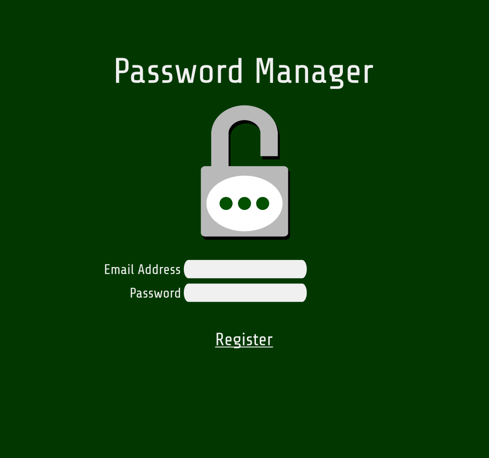

# Password Manager 
This web app is a demo application responsible to storing, generating, and managing user passwords for accounts across the internet.
 
This app is deployed using Azure App Service, and all content posted to the db is subject to deletion.

### Current State
The browser based web app is usable, allowing users to register an account and save profiles.
 
A button also exists on the login page that allows users to log into a 'demo user' account and view/manipulate a predefined assortment of profiles.

### Short Term Todo
<ul>
  <li>Create simple password generator for edit form of a profile.</li>
</ul>

### Long Term Todo
<ul>
  <li>Create an android application that uses a web api to interface with the service.</li>
</ul>

## Component Model

## Entity-Relationship Model

## Login Page Mockup

